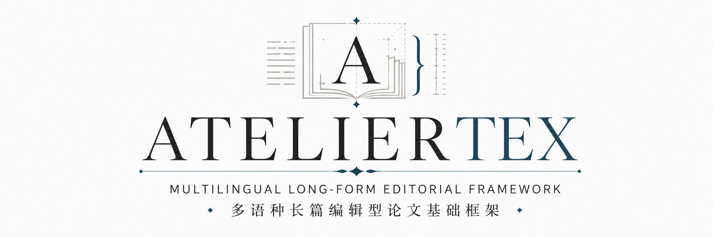
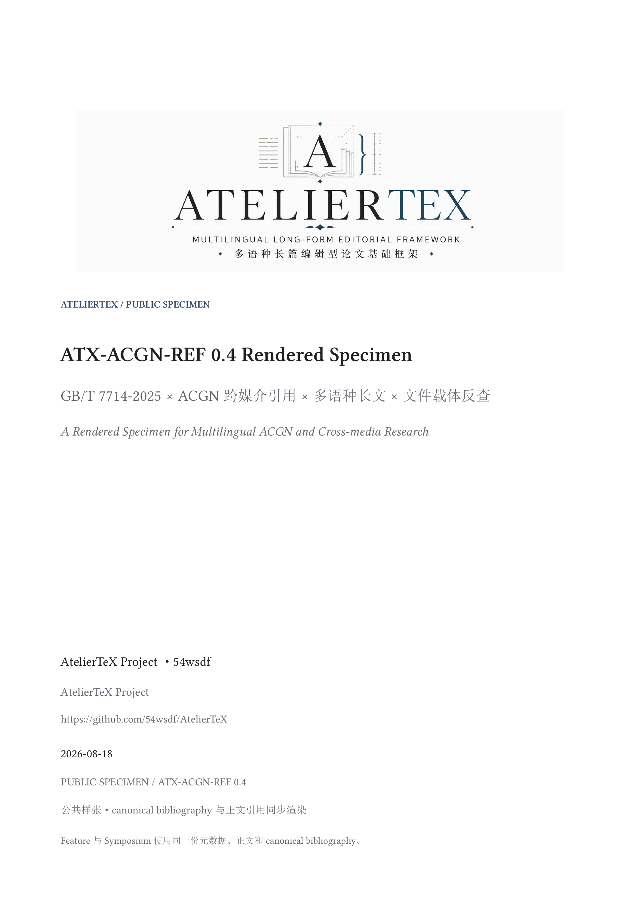
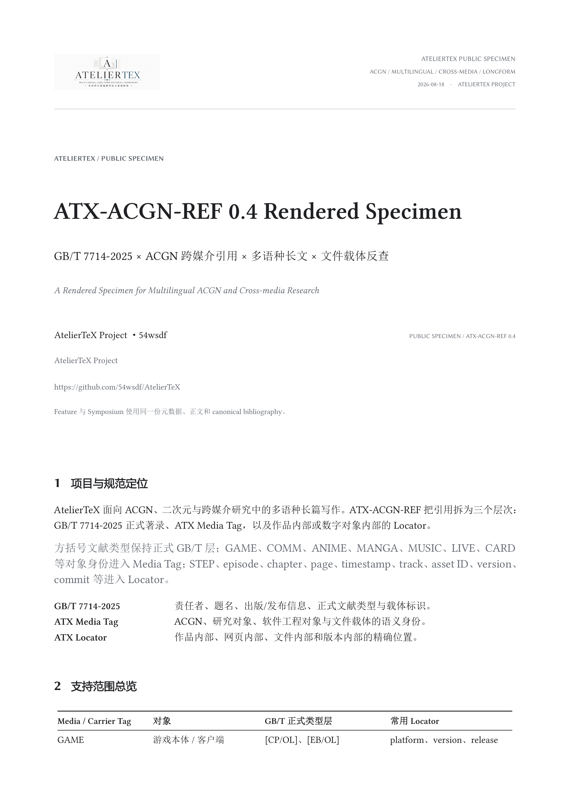
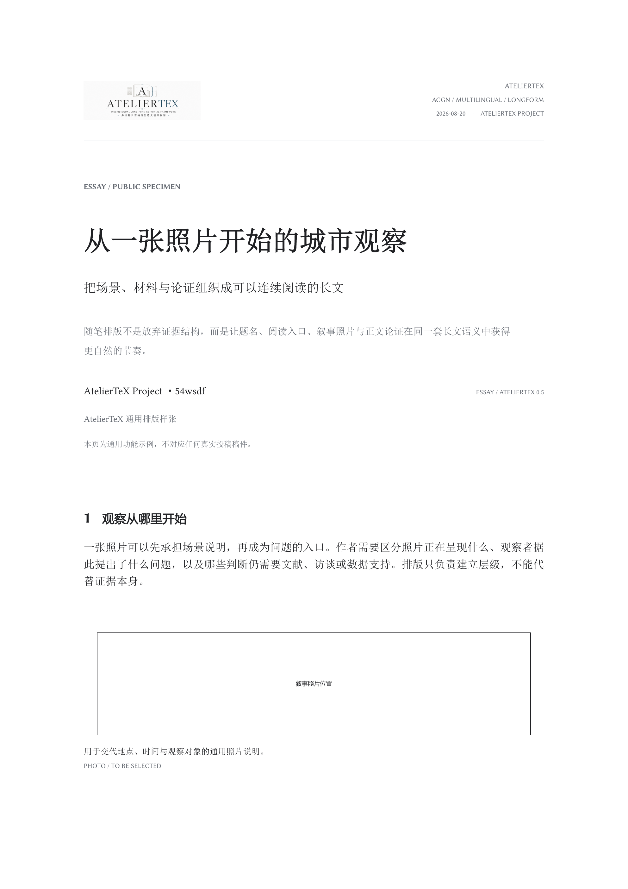

# AtelierTeX

<p align="center">
  
</p>

> **面向 ACGN / 二次元 / 跨媒介人文研究的多语种长篇 LaTeX 论文基础框架。**  
> *An ACGN-friendly multilingual long-form editorial framework for media studies, visual research, and narrative scholarship.*

AtelierTeX 由 **54wsdf** 发起并维护。项目面向长篇研究中经常同时出现的多语种原文、游戏剧情、动画集数、漫画章节、歌曲、Live、卡面、PV、直播、视觉证据、数字文件和叙事型章节结构，并提供可替换的 publication profile。

## 项目定位 / Project scope

AtelierTeX 适用于角色研究、游戏研究、动画与漫画研究、轻小说与视觉小说研究、偶像企划、VTuber / Live / 粉丝文化、跨媒介研究，以及一般人文、设计、社会科学和长篇技术写作。  
AtelierTeX is designed for character studies, game studies, anime and manga research, light novels and visual novels, idol projects, VTuber / Live / fan studies, cross-media research, and long-form humanities, design, social-science, and technical writing.

项目定位、范围和署名见 [`PROJECT.md`](PROJECT.md)。  
See [`PROJECT.md`](PROJECT.md) for project scope and attribution.

## 平行标题页排版 / Parallel title layouts

AtelierTeX 0.5 提供三种并列排版。每种排版都有独立的 TeX 入口、PDF 和 PNG：

| 名称 | 选择方式 | 适用问题 |
| --- | --- | --- |
| `feature` / 专题封面 | `titlelayout=feature` | 独立封面、公开长文、专题文章与展示页 |
| `symposium` / 研讨会刊页 | `titlelayout=symposium` | 投稿样张、会议论文与首页信息密度较高的文稿 |
| `essay` / 随笔刊页 | `titlelayout=essay` | 文化随笔、观察札记与叙事型公开长文 |

### Feature / 专题封面

<p align="center">
  
</p>

### Symposium / 研讨会刊页

<p align="center">
  
</p>

### Essay / 随笔刊页

<p align="center">
  
</p>

两图均由当前 `atelier.cls`、模块、标准书目与完整样张源码编译生成。每种排版都有独立的 TeX 入口、PDF 和 PNG。

```powershell
pwsh -File tests/render-readme-preview.ps1 -Engine xelatex
```

Feature 样张入口为 [`examples/full-specimen/main.tex`](examples/full-specimen/main.tex)，Symposium 独立入口为 [`examples/full-specimen-symposium/main.tex`](examples/full-specimen-symposium/main.tex)，Essay 入口为 [`examples/essay-longread-demo/main.tex`](examples/essay-longread-demo/main.tex)。前两者复用同一份完整正文，Essay 使用通用随笔样张。

- A4 长文结构 / A4 long-form layout;
- 通用 Masthead / generic Masthead;
- 60 余种 Media / Carrier Tag / 60+ Media / Carrier Tags;
- 42 条 canonical bibliography 记录 / 42 canonical bibliography records;
- 正文 `\cite`、作品内部 Locator 与最终参考文献渲染 / in-text citations, internal locators, and rendered references;
- 多语种正文与长表 / multilingual text and long tables;
- 数字文件载体反查 / digital-carrier lookup;
- Word / DOCM Companion 设计接口 / Word / DOCM Companion semantics.

引用演示的标准入口是 [`examples/gbt7714-acgn-profile/`](examples/gbt7714-acgn-profile/)：同一目录直接展示 `.bib` 写法、正文引用和 bibliography 输出。  
The canonical citation showcase is [`examples/gbt7714-acgn-profile/`](examples/gbt7714-acgn-profile/), where `.bib` input, in-text citation, and bibliography rendering are shown together.

真实公开来源索引 / Real-world source index：[`docs/REAL_WORLD_EXAMPLES.md`](docs/REAL_WORLD_EXAMPLES.md)

## ATX-ACGN-REF 0.4

AtelierTeX 维护独立的 **ACGN 引用扩展规范 / ACGN Citation Profile**：

**[`ATX-ACGN-REF 0.4 — AtelierTeX ACGN 引用扩展规范 / AtelierTeX ACGN Citation Profile`](docs/ATX-ACGN-REF.md)**

正式著录层采用 **GB/T 7714-2025**；AtelierTeX 在其上增加 Media Tag 与媒介专属 Locator。  
The formal bibliographic layer follows **GB/T 7714-2025**, while AtelierTeX adds Media Tags and media-specific locators.

### 三层结构 / Three-layer model

```text
[顺序号 / No.]  ATX MEDIA TAG  GB/T 7714-2025 正式著录 / formal entry  +  ATX LOCATOR
```

### Media / Carrier Tags

```text
GAME / GAME VERSION / DLC / COMM / ROUTE / EVENT / CARD / CG / COSTUME / 3D MODEL
ANIME / ANIME EP / OVA / FILM / PV / MV / STREAM / VTALENT FILE
MANGA VOL / MANGA CH / NOVEL VOL / NOVEL CH / DOUJIN / FANBOOK / ARTBOOK
MUSIC SINGLE / MUSIC ALBUM / MUSIC TRACK / DRAMA CD / RADIO / PODCAST / LIVE / STAGE
CHARACTER FILE / SETTING FILE / CREATOR FILE / INTERVIEW / NEWS / SOCIAL
FAN LOCATOR / FAN STUDY / STANDARD / REPORT / PREPRINT / DATASET
REPOSITORY / RELEASE / COMMIT / PDF / DOCX / PPTX / XLSX / CSV / JSON / YAML
IPYNB / PNG / SVG / AUDIO FILE / VIDEO FILE / SUBTITLE / ARCHIVE / WEB ARCHIVE
```

完整中英对照定义见规范正文。  
See the specification for the full Chinese-English definitions of each tag family.

### 正文定位 / In-text locators

```latex
\cite{gakumas_game}
\cite[STEP1 / Episode 8]{hiro_commu_step1_08}
\cite[Episode 1]{umamusume_anime_ep01}
\cite{hiro_song_koukei,hiro_1st_single}
```

- 真实样例索引 / Real-world examples：[`docs/REAL_WORLD_EXAMPLES.md`](docs/REAL_WORLD_EXAMPLES.md)
- 可编译引用案例 / Compilable citation showcase：[`examples/gbt7714-acgn-profile/`](examples/gbt7714-acgn-profile/)
- 对象级渲染目录 / Object-level catalog：[`docs/ATX-ACGN-REF.md#object-catalog`](docs/ATX-ACGN-REF.md#object-catalog)
- 文件扩展名反查 / File-extension matrix：[`docs/ATX-ACGN-REF.md#file-matrix`](docs/ATX-ACGN-REF.md#file-matrix)

## 通用头图 / Generic Masthead

当前默认 Masthead 为 `assets/ateliertex-masthead.png`。仓库保留 2172×724 像素原始白底资产，README 按较小显示宽度呈现，避免向上插值。

The default Masthead is `assets/ateliertex-masthead.png`. The repository keeps the 2172×724 opaque source asset and displays it below native width in the README.

```latex
\AtelierSetMasthead{assets/my-project-banner.png}
\AtelierSetMastheadWidth{0.88\textwidth}
\AtelierShowMasthead
```

Publication Profile 可以替换这一位置与公共元数据槽，但继续复用具名排版骨架并生成自己的独立渲染证据。

## 快速开始 / Quick start

推荐环境 / Recommended environment：TeX Live 2026、XeLaTeX、LuaLaTeX、`latexmk`、`biber`，以及提供 `gb7714-2025` 的当前 `biblatex-gb7714` 包。

默认推荐 **XeLaTeX** 生成规范发布 PDF、冻结分页与 README 渲染图；**LuaLaTeX** 作为内容、字形和跨环境兼容性检查。两个引擎都属于受支持后端，但字体度量不同，因此不承诺完全相同的分页。

The canonical release and README-preview engine is **XeLaTeX**. **LuaLaTeX** remains a supported compatibility target; identical pagination across engines is not guaranteed.

```latex
\documentclass[profile=editorial,titlelayout=feature]{atelier}
\AtelierUseACGNBibliography
\addbibresource{references.bib}

\title{一个角色研究示例}
\author{作者}

\begin{document}
\maketitle
\section{问题的提出}
正文\cite{gakumas_game}。
\printbibliography
\end{document}
```

切换到研讨会刊页只改 class option：

```latex
\documentclass[profile=editorial,titlelayout=symposium]{atelier}
```

未来的平行标题页通过注册表扩展：

```latex
\AtelierDeclareTitleLayout{layout-name}{\MyTitleRenderer}
\AtelierUseTitleLayout{layout-name}
```

每个公开注册项必须同时提供独立可编译入口与渲染图。

兼容既有 GB/T 7714-2015 工程 / Legacy compatibility：

```latex
\AtelierUseACGNBibliographyLegacy
```

## 五种基础 Profile / Base profiles

| Profile | 适用场景 / Use case |
| --- | --- |
| `academic` | 传统学术论文、规范型研究 / conventional academic writing |
| `editorial` | 人文 / 设计期刊式长篇 / editorial long-form writing |
| `narrative` | 角色研究、游戏研究、文学评论 / narrative and media analysis |
| `visual` | 截图、卡面、分镜和视觉证据较多的研究 / visual-evidence-heavy essays |
| `essay` | 文化随笔、观察札记与叙事型公开长文 / cultural essays and research notes |

## Word / DOCM Companion

未来的 Word 前端将复用同一套 Media Tag、Locator 和 GB/T 7714-2025 语义。  
The planned Word frontend will reuse the same Media Tag, Locator, and GB/T 7714-2025 semantics.

设计 / Design：[`docs/WORD_COMPANION.md`](docs/WORD_COMPANION.md)

## 文档入口 / Documentation

- [`PROJECT.md`](PROJECT.md)：项目定位与署名 / scope and attribution
- [`docs/ATX-ACGN-REF.md`](docs/ATX-ACGN-REF.md)：唯一权威引用规范，含完整格式目录与文件载体反查 / canonical citation profile with catalog and file matrix
- [`对象级渲染目录`](docs/ATX-ACGN-REF.md#object-catalog)：按研究对象查看最终著录形态 / object-level rendering catalog
- [`文件与载体矩阵`](docs/ATX-ACGN-REF.md#file-matrix)：按文件后缀反查对象身份 / file-carrier lookup
- [`docs/REAL_WORLD_EXAMPLES.md`](docs/REAL_WORLD_EXAMPLES.md)：真实来源样例 / real-world examples
- [`docs/USER_GUIDE.md`](docs/USER_GUIDE.md)：使用说明 / user guide
- [`docs/FONTS_AND_LANGUAGES.md`](docs/FONTS_AND_LANGUAGES.md)：字体与多语种 / fonts and languages
- [`docs/development/README.md`](docs/development/README.md)：开发资料 / development notes

## 项目署名与引用 / Citation

推荐项目引用 / Recommended project citation：

> 54wsdf. *AtelierTeX: An ACGN-friendly Multilingual Long-form Editorial Framework*. 2026.

推荐规范引用 / Recommended profile citation：

> 54wsdf. *AtelierTeX ACGN Citation Profile (ATX-ACGN-REF 0.4)*. AtelierTeX Project, 2026.

GitHub 标准引用元数据 / GitHub citation metadata：[`CITATION.cff`](CITATION.cff)

## 许可证 / License

本仓库自有源码、文档、示例、测试与项目生成的预览素材采用 **LPPL-1.3c**。项目维护状态为 `maintained`，当前维护者为 `54wsdf`。完整协议、适用范围与 Work 清单分别见 [`LICENSE`](LICENSE)、[`LICENSE_SCOPE.md`](LICENSE_SCOPE.md) 与 [`manifest.txt`](manifest.txt)。

All repository-owned source code, documentation, examples, tests, and project-generated preview assets are released under **LPPL-1.3c**. See [`LICENSE_SCOPE.md`](LICENSE_SCOPE.md) and [`manifest.txt`](manifest.txt) for the exact scope.
